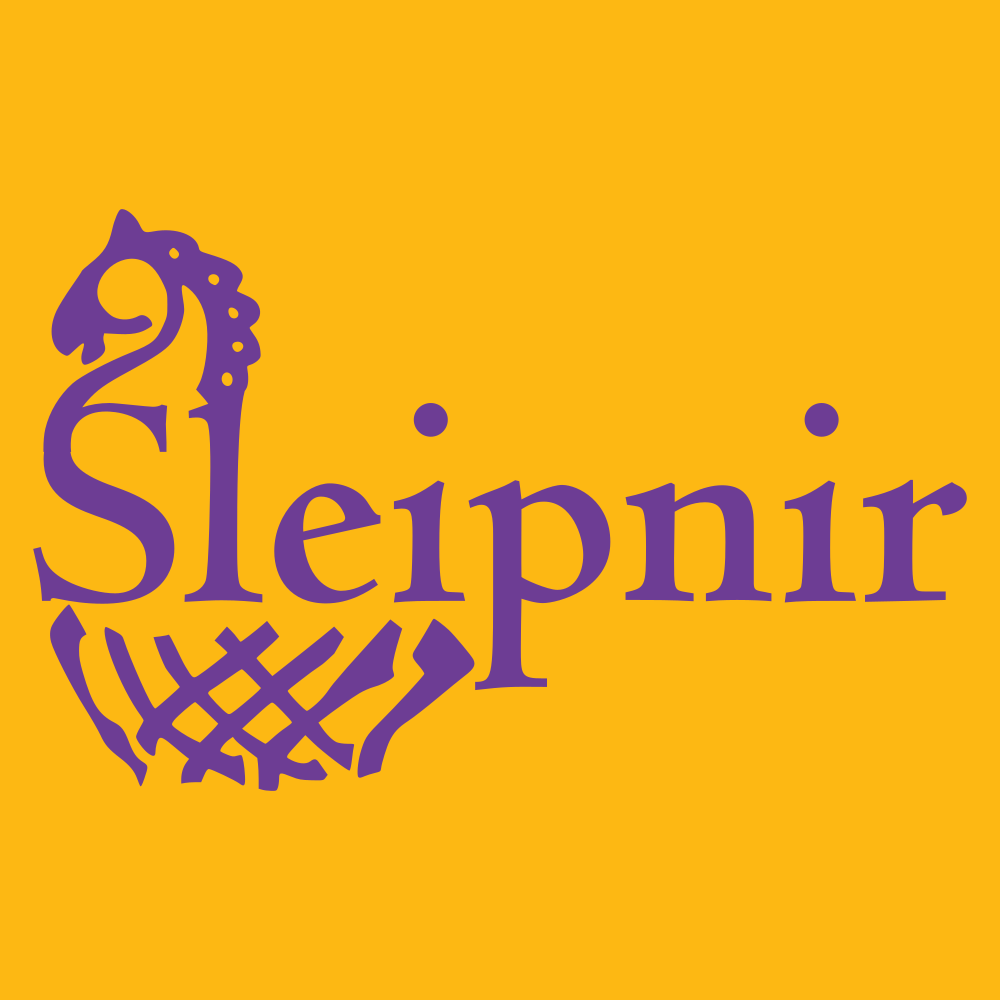

# Sleipnir Group
  
Developing and maintaining the Sleipnir constrained optimization problem solver and tools based on it.

## Projects

[Sleipnir](/Sleipnir) — A linearity-exploiting sparse nonlinear constrained optimization problem solver that uses the interior-point method. 

[Choreo](/Choreo) —  A graphical tool for planning time-optimized trajectories for autonomous mobile robots in the FIRST Robotics Competition. 
